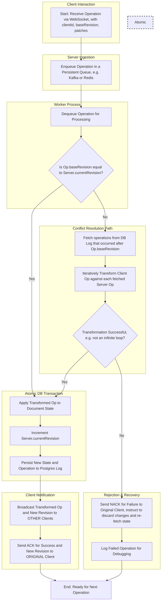

```mermaid
---
config:
  layout: dagre
---
flowchart TD
    subgraph subGraph0["Client Interaction"]
        A["Start: Receive Operation via WebSocket, with clientId, baseRevision, patches"]
    end
    subgraph subGraph1["Server Ingestion"]
        B["Enqueue Operation in a Persistent Queue, e.g. Kafka or Redis"]
    end
    subgraph subGraph2["Worker Process"]
        C["Dequeue Operation for Processing"]
        D{"Is Op.baseRevision equal to Server.currentRevision?"}
    end
    subgraph subGraph3["Conflict Resolution Path"]
        E["Fetch operations from DB Log that occurred after Op.baseRevision"]
        F["Iteratively Transform Client Op against each fetched Server Op"]
        G{"Transformation Successful, e.g. not an infinite loop?"}
    end
    subgraph subGraph4["Atomic DB Transaction"]
        H["Apply Transformed Op to Document State"]
        I["Increment Server.currentRevision"]
        J["Persist New State and Operation to Postgres Log"]
    end
    subgraph subGraph5["Client Notification"]
        K["Broadcast Transformed Op and New Revision to OTHER Clients"]
        L["Send ACK for Success and New Revision to ORIGINAL Client"]
    end
    subgraph subGraph6["Rejection & Recovery"]
        M["Send NACK for Failure to Original Client, instruct to discard changes and re-fetch state"]
        N["Log Failed Operation for Debugging"]
    end
    A --> B
    B --> C
    C --> D
    D -- Yes --> H
    D -- No --> E
    E --> F
    F --> G
    G -- Yes --> H
    G -- No --> M
    H --> I
    I --> J
    J --> K
    K --> L
    L --> O["End: Ready for Next Operation"]
    M --> N
    N --> O
    Atomic["Atomic"]
    style Atomic DB Transaction fill: #f9f9f9, stroke: #333, stroke-width: 2px, stroke-dasharray: 5 5

```